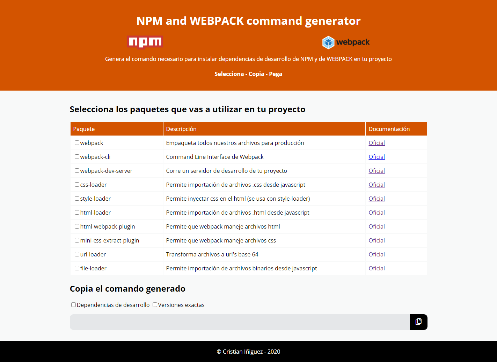

# NPM and WEBPACK command generator

Genera el comando necesario para instalar dependencias de NPM y de WEBPACK en tu proyecto

[Entra aquí](https://cristianiniguez.github.io/npm_webpack_command_generator/)

1. Selecciona los paquetes que vas a descargar a tu proyecto
2. Copia el comando generado con un solo click
3. Pega el comando en tu terminal y ejecútalo

Si conoces otro paquete **hazme un pull request**: Escríbe el paquete en el archivo `packs.json` para que esté también en la página (podrías ser colaborador 💻).

